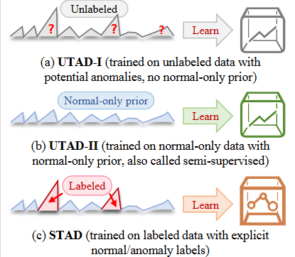

## 📊 Labels Matter More Than Models: <font size=3>Quantifying the Benefit of Supervised Time Series Anomaly Detection</font>


This repository contains the implementation of **STAND** 🚀, a simple supervised time series anomaly detection baseline, as described in our paper. STAND demonstrates that with proper supervision, even simple models can outperform complex unsupervised approaches in time series anomaly detection tasks.


| |
| :---: |
|  |
| *Fig. 1: Classification of time series anomaly detection methods.* |

## 💡 Key Findings

- **Labels Matter More Than Models**: With sufficient labeled data, even simple supervised models consistently outperform sophisticated unsupervised methods.
- **Supervision Brings Higher Returns**: The performance gain from using labeled data far exceeds the improvement from using more complex models.
- **Better Predictive Consistency and Anomaly Localization**: Supervised methods, especially STAND, show superior performance in predicting consistent anomaly scores and precisely localizing anomalies.

## 📁 Project Structure

```
STAND/
├── src/
│   ├── data_utils/     # Data loading utilities
│   ├── exp/            # Experiment configurations and runners
│   ├── models/         # Model implementations
│   │   ├── supervised/ # Supervised models (including STAND)
│   │   └── ...         # Other model implementations
│   ├── scripts/        # Run scripts for different experiments
│   └── utils/          # Utility functions and dataset processing
├── logs/               # Experiment results and logs
├── docs/               # Documentation
├── tests/              # Testing scripts
├── requirements.txt    # Dependencies
└── README.md           # This file
```

## 🔧 Installation

```bash
# Create a virtual environment (recommended)
python -m venv venv
source venv/bin/activate  # On Windows: venv\Scripts\activate

# Install dependencies
pip install -r requirements.txt
```

## 🚀 Usage

### 🎯 Supervised Experiments

Run supervised experiments with STAND and other baselines:

```bash
# Navigate to scripts directory
cd src/scripts

# Run STAND on all datasets
python run_supervised.py

# To run specific configurations, modify the script parameters
# For example, to run only STAND on specific datasets:
cd src/exp
python supervised.py --model_name STAND --dataset_name PSM
```

### 🔍 Unsupervised Experiments

```bash
# Run unsupervised baselines
python run_unsupervised.py
```

### 🔄 Semi-supervised Experiments

```bash
# Run semi-supervised approaches
python run_semisupervised.py
```

## 📚 Datasets

The code supports five real-world time series datasets (PSM, SWaT, WADI, Swan, Water) for anomaly detection.

For dataset downloading, please refer to the [FTSAD](https://github.com/EmorZz1G/FTSAD) project.


## 🏆 Key Results

### 📈 Performance Comparison

- **Supervised methods (STAD)** significantly outperform traditional unsupervised methods (UTAD-I) and deep learning-based unsupervised methods (UTAD-II).
- **STAND baseline** achieves the best overall performance across multiple datasets.

### 📊 Supervision Benefit Analysis

- Using only 10% of labeled PSM data, a simple ExtraTrees model already outperforms the best unsupervised method.
- Performance scales consistently with more labeled data, showing the substantial benefit of supervision.


## 📝 Citation

If you use this code in your research, please cite our paper:

```
TODO
```

## 📄 License

This project is licensed under the [MIT License](LICENSE).